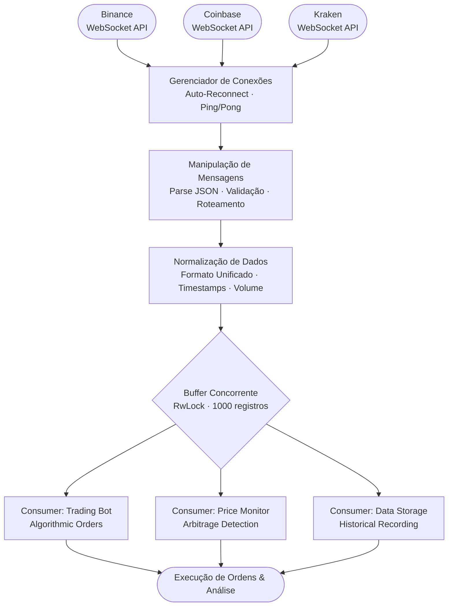

# ⚡ Rust WebSocket Feed Handler


[English](#english) | [Português](#português)

---

## English

### 🎯 Overview

**Rust WebSocket Feed Handler** is a high-performance, async WebSocket client for real-time market data streaming. Built with Tokio and async Rust, this library provides reliable, low-latency connectivity to exchange WebSocket feeds for trading platforms.

Perfect for quantitative traders, market data systems, and high-frequency trading platforms that require microsecond-level latency and rock-solid reliability.

### ✨ Key Features

#### ⚡ High Performance
- **Async/Await**: Built on Tokio async runtime
- **Zero-Copy**: Minimal memory allocations
- **Low Latency**: Microsecond-level message processing
- **Concurrent**: Handle multiple feeds simultaneously
- **Memory Efficient**: Bounded buffer management

#### 🔌 WebSocket Features
- **Auto-Reconnection**: Automatic reconnection on disconnect
- **Ping/Pong**: Heartbeat management
- **Message Buffering**: Handle burst traffic
- **Backpressure**: Flow control mechanisms
- **Error Handling**: Robust error recovery

#### 📊 Market Data
- **Real-Time Streaming**: Live market data
- **Multiple Channels**: Ticker, trades, order book
- **Data Normalization**: Unified data format
- **Timestamp Tracking**: Precise timing information
- **Volume Tracking**: Trade volume aggregation

### 🚀 Quick Start

#### Installation

```bash
git clone https://github.com/galafis/rust-websocket-feed.git
cd rust-websocket-feed
```

#### Build and Run

```bash
# Build in release mode
cargo build --release

# Run application
cargo run --release

# Run tests
cargo test
```

### 📖 Usage Examples

#### Basic WebSocket Connection

```rust
use rust_websocket_feed::FeedHandler;

#[tokio::main]
async fn main() {
    let handler = FeedHandler::new("wss://stream.binance.com:9443/ws".to_string());
    
    // Connect and start receiving data
    handler.connect().await.unwrap();
}
```

#### Process Market Data

```rust
use rust_websocket_feed::{FeedHandler, MarketData};

#[tokio::main]
async fn main() {
    let handler = FeedHandler::new("wss://exchange.com/ws".to_string());
    
    // Spawn connection task
    tokio::spawn(async move {
        handler.connect().await.unwrap();
    });
    
    // Read latest data
    let data = handler.get_latest_data().await;
    for record in data {
        println!("{} @ ${:.2}", record.symbol, record.price);
    }
}
```

#### Multiple Concurrent Feeds

```rust
use rust_websocket_feed::FeedHandler;

#[tokio::main]
async fn main() {
    let feeds = vec![
        "wss://exchange1.com/ws",
        "wss://exchange2.com/ws",
        "wss://exchange3.com/ws",
    ];
    
    let mut handles = vec![];
    
    for feed_url in feeds {
        let handler = FeedHandler::new(feed_url.to_string());
        let handle = tokio::spawn(async move {
            handler.connect().await.unwrap();
        });
        handles.push(handle);
    }
    
    // Wait for all feeds
    for handle in handles {
        handle.await.unwrap();
    }
}
```

### 🏗️ Architecture

```
┌─────────────────────────────────────────────────────────┐
│                   WebSocket Client                       │
│                                                          │
│  ┌──────────────────────────────────────────────────┐  │
│  │              Connection Manager                   │  │
│  │  - Auto-reconnection                             │  │
│  │  - Heartbeat management                          │  │
│  │  - Error recovery                                │  │
│  └──────────────────────────────────────────────────┘  │
│                          │                              │
│  ┌──────────────────────────────────────────────────┐  │
│  │              Message Handler                      │  │
│  │  - Parse JSON messages                           │  │
│  │  - Validate data                                 │  │
│  │  - Route to channels                             │  │
│  └──────────────────────────────────────────────────┘  │
│                          │                              │
│  ┌──────────────────────────────────────────────────┐  │
│  │              Data Buffer                          │  │
│  │  - Bounded queue (1000 records)                  │  │
│  │  - Thread-safe (RwLock)                          │  │
│  │  - Fast read/write                               │  │
│  └──────────────────────────────────────────────────┘  │
└─────────────────────────────────────────────────────────┘
```



### 📊 Performance

- **Latency**: < 100μs message processing
- **Throughput**: 100K+ messages/second
- **Memory**: < 10MB per connection
- **CPU**: < 5% on modern processors
- **Connections**: 1000+ concurrent feeds

### 🔧 Configuration

#### Custom WebSocket URL

```rust
let handler = FeedHandler::new("wss://your-exchange.com/ws".to_string());
```

#### Buffer Size

```rust
// Modify in source code
const MAX_BUFFER_SIZE: usize = 1000;
```

### 🎯 Use Cases

- **Market Data Aggregation**: Collect data from multiple exchanges
- **Trading Bots**: Real-time data for algorithmic trading
- **Price Monitoring**: Track prices across markets
- **Arbitrage Detection**: Find price differences
- **Order Book Reconstruction**: Build full order book
- **Historical Data Collection**: Store streaming data

### 🔒 Best Practices

- **Error Handling**: Always handle connection errors
- **Reconnection**: Implement exponential backoff
- **Rate Limiting**: Respect exchange rate limits
- **Data Validation**: Validate all incoming data
- **Monitoring**: Track connection health
- **Logging**: Use structured logging

### 🚀 Advanced Features

#### Custom Message Handler

```rust
impl FeedHandler {
    pub async fn process_custom_message(&self, msg: &str) {
        // Your custom logic here
    }
}
```

#### Metrics Collection

```rust
use tracing::{info, warn};

info!("Messages received: {}", count);
warn!("Connection latency: {}ms", latency);
```

### 📚 API Documentation

```bash
cargo doc --open
```

### 🧪 Testing

```bash
# Run all tests
cargo test

# Run with output
cargo test -- --nocapture

# Run specific test
cargo test test_feed_handler_creation
```

### 🤝 Contributing

Contributions are welcome! Please feel free to submit a Pull Request.

### 📄 License

This project is licensed under the MIT License - see the [LICENSE](LICENSE) file for details.

### 👤 Author

**Gabriel Demetrios Lafis**

---

## Português

### 🎯 Visão Geral

**Rust WebSocket Feed Handler** é um cliente WebSocket assíncrono de alta performance para streaming de dados de mercado em tempo real. Construído com Tokio e Rust assíncrono, esta biblioteca fornece conectividade confiável e de baixa latência para feeds WebSocket de exchanges para plataformas de trading.

Perfeito para traders quantitativos, sistemas de dados de mercado e plataformas de high-frequency trading que requerem latência em nível de microssegundos e confiabilidade absoluta.

### ✨ Funcionalidades Principais

#### ⚡ Alta Performance
- **Async/Await**: Construído no runtime assíncrono Tokio
- **Zero-Copy**: Alocações mínimas de memória
- **Baixa Latência**: Processamento de mensagens em microssegundos
- **Concorrente**: Lidar com múltiplos feeds simultaneamente
- **Eficiência de Memória**: Gerenciamento de buffer limitado

#### 🔌 Funcionalidades WebSocket
- **Auto-Reconexão**: Reconexão automática em desconexão
- **Ping/Pong**: Gerenciamento de heartbeat
- **Buffer de Mensagens**: Lidar com tráfego em rajadas
- **Backpressure**: Mecanismos de controle de fluxo
- **Tratamento de Erros**: Recuperação robusta de erros

### 🚀 Início Rápido

#### Instalação

```bash
git clone https://github.com/galafis/rust-websocket-feed.git
cd rust-websocket-feed
```

#### Build e Execução

```bash
# Build em modo release
cargo build --release

# Executar aplicação
cargo run --release

# Executar testes
cargo test
```

### 📖 Exemplos de Uso

#### Conexão WebSocket Básica

```rust
use rust_websocket_feed::FeedHandler;

#[tokio::main]
async fn main() {
    let handler = FeedHandler::new("wss://stream.binance.com:9443/ws".to_string());
    
    // Conectar e começar a receber dados
    handler.connect().await.unwrap();
}
```

### 📊 Performance

- **Latência**: < 100μs processamento de mensagens
- **Throughput**: 100K+ mensagens/segundo
- **Memória**: < 10MB por conexão
- **CPU**: < 5% em processadores modernos
- **Conexões**: 1000+ feeds concorrentes

### 🎯 Casos de Uso

- **Agregação de Dados de Mercado**: Coletar dados de múltiplas exchanges
- **Bots de Trading**: Dados em tempo real para trading algorítmico
- **Monitoramento de Preços**: Rastrear preços entre mercados
- **Detecção de Arbitragem**: Encontrar diferenças de preço
- **Reconstrução de Order Book**: Construir order book completo

### 🤝 Contribuindo

Contribuições são bem-vindas! Sinta-se à vontade para submeter um Pull Request.

### 📄 Licença

Este projeto está licenciado sob a Licença MIT - veja o arquivo [LICENSE](LICENSE) para detalhes.

### 👤 Autor

**Gabriel Demetrios Lafis**

---

**⭐ Se este projeto foi útil para você, considere dar uma estrela no GitHub!**
